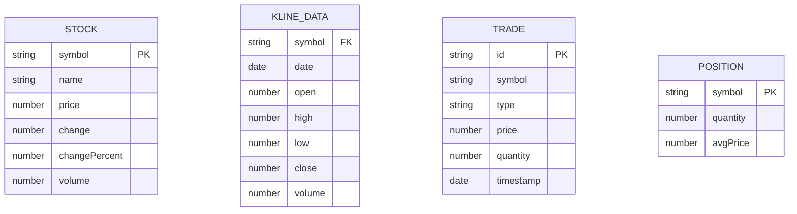

## 1. Architecture Design

```mermaid
graph TB
    subgraph "Frontend (React + Vite)"
        A[Dashboard Page]
        B[Stock Detail Page]
        C[Backtest Page]
        D[Paper Trading Page]
        E[Components]
        F[Hooks]
    end
    
    subgraph "Data Layer"
        G[Mock Stock Data]
        H[LocalStorage (for trades)]
    end
    
    subgraph "Libraries"
        I[ECharts - Charts]
        J[Lucide - Icons]
        K[Zustand - State]
    end
    
    A --&gt; E
    B --&gt; E
    C --&gt; E
    D --&gt; E
    E --&gt; F
    A --&gt; G
    B --&gt; G
    C --&gt; G
    D --&gt; G
    D --&gt; H
    E --&gt; I
    E --&gt; J
    F --&gt; K
```

## 2. Technology Description
- **Frontend**: React@18 + TypeScript + tailwindcss@3 + vite
- **Initialization Tool**: vite-init
- **Backend**: None (纯前端应用，使用模拟数据)
- **Database**: LocalStorage (存储模拟交易记录)
- **Charting Library**: ECharts 5.x
- **State Management**: Zustand
- **Icons**: Lucide React

## 3. Route Definitions
| Route | Purpose |
|-------|---------|
| / | 仪表盘首页 - 市场概览和热门股票 |
| /stock/:symbol | 股票详情页 - K线图和技术指标 |
| /backtest | 策略回测页 - 策略配置和回测结果 |
| /trading | 模拟交易页 - 持仓和交易记录 |

## 4. API Definitions (if backend exists)
本项目为纯前端应用，不涉及后端 API。所有数据使用模拟数据生成。

## 5. Server Architecture Diagram (if backend exists)
不适用，本项目为纯前端应用。

## 6. Data Model (if applicable)

### 6.1 Data Model Definition



### 6.2 Data Definition Language
不适用，使用前端模拟数据和 LocalStorage 存储。
