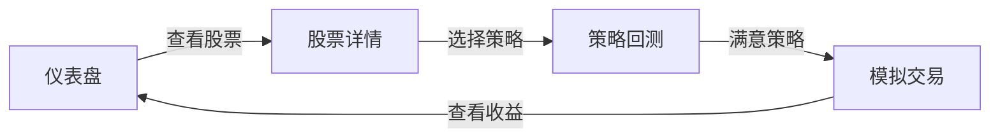

## 1. Product Overview
股票量化交易系统是一个面向个人投资者的量化交易分析平台，提供股票数据可视化、策略回测和模拟交易功能，帮助用户学习和实践量化投资策略。

## 2. Core Features

### 2.1 User Roles
| Role | Registration Method | Core Permissions |
|------|---------------------|------------------|
| Normal User |无需注册 |浏览所有功能，使用模拟数据进行回测 |

### 2.2 Feature Module
1. **仪表盘首页**: 市场概览、热门股票、收益率统计
2. **股票详情页**: K线图、技术指标、历史数据
3. **策略回测页**: 策略配置、回测参数、结果展示
4. **模拟交易页**: 持仓管理、交易记录、收益曲线

### 2.3 Page Details
| Page Name | Module Name | Feature description |
|-----------|-------------|---------------------|
| 仪表盘 | 市场概览 | 展示上证指数、深证成指等主要指数实时走势 |
| 仪表盘 | 热门股票 | 显示涨幅榜、跌幅榜、成交量排行 |
| 股票详情 | K线图 | 交互式K线图，支持日/周/月周期切换 |
| 股票详情 | 技术指标 | MACD、KDJ、RSI等常用技术指标展示 |
| 策略回测 | 策略配置 | 提供经典策略模板，支持自定义参数 |
| 策略回测 | 回测结果 | 收益率曲线、最大回撤、胜率等指标 |
| 模拟交易 | 持仓管理 | 实时计算持仓市值和盈亏 |
| 模拟交易 | 交易记录 | 完整记录所有买卖操作 |

## 3. Core Process
用户访问系统 → 浏览市场数据 → 查看股票详情 → 配置回测策略 → 查看回测结果 → 进行模拟交易

## 4. User Interface Design
### 4.1 Design Style
- **主色调**: 深蓝色 (#0f172a) 配合科技感青色 (#06b6d4)
- **辅色**: 绿色 (#10b981) 表示上涨，红色 (#ef4444) 表示下跌
- **按钮风格**: 圆角矩形，带有轻微阴影和悬停效果
- **字体**: 现代无衬线字体，标题加粗，数字使用等宽字体
- **布局风格**: 卡片式布局，网格排列，清晰的信息层级
- **图标**: 使用线性图标，保持简洁现代风格

### 4.2 Page Design Overview
| Page Name | Module Name | UI Elements |
|-----------|-------------|-------------|
| 仪表盘 | 市场概览 | 大数字展示指数变化，小图表预览走势，卡片式布局 |
| 股票详情 | K线图 | 全屏交互式图表，工具栏在顶部，指标在底部 |
| 策略回测 | 回测结果 | 左右分栏，左侧配置，右侧结果图表和统计 |
| 模拟交易 | 持仓 | 表格展示，盈亏用颜色区分，带有渐变背景 |

### 4.3 Responsiveness
桌面端优先设计，适配平板和移动端。关键图表组件在移动端保持可读性，表格支持横向滚动。

### 4.4 3D Scene Guidance
本项目不涉及3D场景
